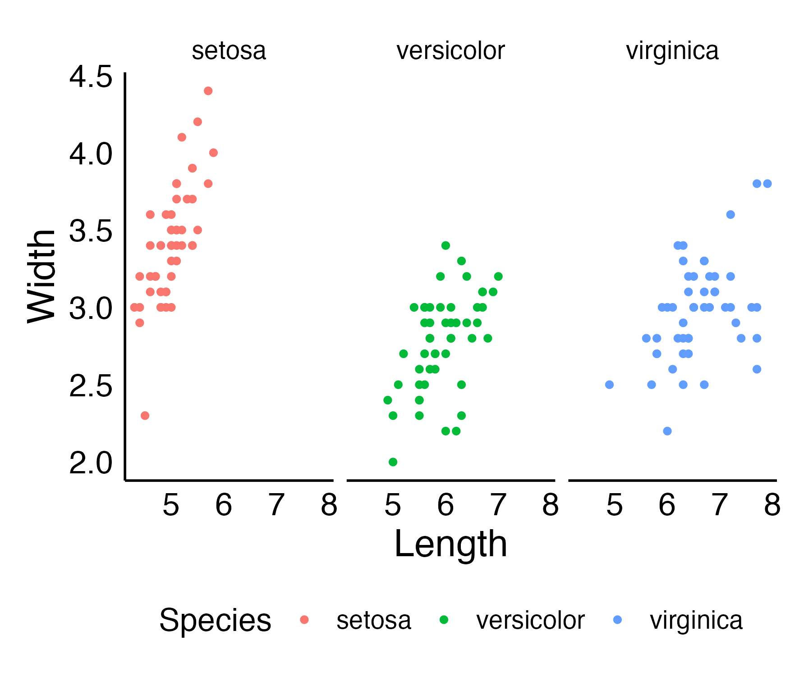

# ggdoctheme
This is a redesigned ggplot theme built for out of the box scientific publication
Use this theme with your normal ggplot function.

Installing the package

```
devtools::install_github("rishavray/ggdoctheme")
```

Run the code like this in R
```
iris %>% 
ggplot(aes(x = Sepal.Length, y = Sepal.Width, color = Species)) +
geom_point() +
facet_wrap(~Species) +
theme_doc()+
labs(x = "Length", y = "Width")
```
This creates a plot like this
